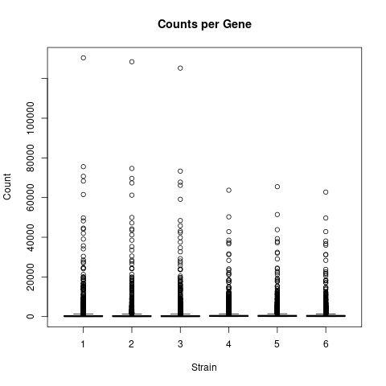
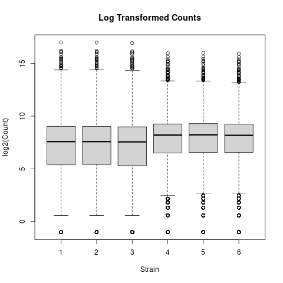

# Analysis of RNA-seq counts
Murray Cadzow
20/04/2021

The original dataset comes from a yeast RNA-seq experiment, Lee et al 2008. This analysis uses a subset of 6 samples (3 WT / 3 MT) to look at differential expression of Wild-type versus RNA degradation mutants using single end sequencing data.

The count data was generated as part of the Genomics Aotearoa RNA-seq workshop

There are 7120 genes (rows) that will be compared in order to establish if there has been differential expression. First, we shall take a look at the counts per gene.

The data is highly skewed which suggests a log transform would be useful. This will be done by adding 0.5 to the counts to prevent a log2(0) issue.

This has improved the visualisation of the data.

To re-run the analysis, simply run the Rscript included. To run on NeSI see the attached SLURM script.
